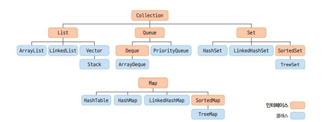

<!--more-->
## 복습 정리

## 4주차 정리
벌써 4주차

#### 리소스
리소스란? 데이터를 제공하는 객체.
DAO(Data Access Object) -> 데이터 처리 객체.
DTO(Data Transfer Object) -> 데이터 전송 객체.
VO(Value Object) -> 데이터 객체

#### 제네릭
제네릭이란? 
정의되지 않은 타입을 파라미터로 처리하고 실제 사용할 때 파라미터를 구체적인 타입으로 대체시키는 것.
객체를 저장할 때 저장할 내용물의 타입을 미리 알려주고, 읽을 때 어떤 타입으로 제공할지를 알게 표시.
Box는 content에 무엇이 대입되고, 읽을 때 어떤 타입으로 제공할지를 알게 정하는것.
```java
public class Box <T>{
    public T content;

}
```
타입 파라미터 기호
- < T > : 타입
- < E > : 요소 Element, List
- < K > : Key, Map
- < N > : 숫자
- < S, U, K > : 2,3,4 선언된 타입

### 자료구조
자료구조란?
대향의 데이터를 효율적으로 관리할 수 있는 데이터의 구조.
특성에 따라, 체계적으로 데이터를 구조화 해야한다.
- 어떤 데이터 구조를 사용하느냐에 따라서 코드의 효율성이 달라진다.

### 컬렉션
컬렉션이란?
배열처럼 데이터를 저장하는 데 사용된다. 
하지만 배열과 달리 크기가 유동적이며 요구 사항에 따라 크기를 늘리거나 줄일 수 있다. 
  

### List 컬렉션
- Collection 인터페이스의 자식 인터페이스
- 선형 자료 구조의 형태로 요소를 저장함
- 요소를 인덱스로 관리하기 때문에 요소를 저장하면 자동으로 저장 순서의 인덱스가 부여
```java
List<E> 객체명 = new 자식클래스명<>();
```
#### ArrayList
- List 인터페이스를 구현한 클래스
- 선형 순서로 저장하는데 사용하는 배열 기반 데이터 구조
- 배열과 달리 크기가 가변적으로 변한다.
#### LinkedList
- List 인터페이스를 구현한 클래스 
- 데터와 포인터를 가진 요소가 선형 순서로 저장된다.
- 삽입, 삭제가 빈번하게 사용되는 곳에서 유용
#### Vector
- ArrayList와 마찬가지고 선형 순서로 저장하지만 자동 동기화를 보장하기 때문에 멀티 스레드 환경에서 안정적으로 사용할 수 있다. 

### Set 컬렉션
- 비선형 자료 구조의 형태로 요소를 저장한다.
- Set 컬렉션은 요소를 인덱스로 관리하지 않기 때문에 저장 순서가 보장 되지 않음
- iterator() 메서드로 Iterator 클래스의 객체를 생성하고 데이터를 가져와야 함.
- 중복 저장이 안되고 null도 하나밖에 저장 수 있음
```java
Set<자료형> 객체명 = new 자식클래스명<자료형>();
```
#### HashSet
- 요소를 저장하기 위해 해싱(hashing) 방법을 활용 → 정보를 저장하는 해시 테이블 이용
#### TreeSet
- 요소를 중복해서 저장할 수 없고 저장 순서가 유지되지 않는 비선형 트리 기반 데이터 구조
- 이진 탐색 트리(binary search tree) 구조로 데이터를 저장함.
- 데이터를 추가하거나 삭제할 때는 HashSet 보다는 느리지만 데이터 검색, 정렬은 효과적

### Map 컬렉션
- 키(Key)와 값(Value)으로 구성된 자료 구조의 형태로 데이터를 저장
 → 키는 중복해서 저장할 수 없지만 값은 중복해서 저장이 가능 
```java
Map<Key, Value> obj = new 자식클래스명<Key, Value>();
```
#### HashMap
- 저장 순서를 보장하지 않음
- 해싱을 사용하기 때문에 많은 양의 데이터를 검색 하는 데 유용함

#### TreeMap
- 요소를 중복해서 저장할 수 없고 저장 순서가 유지되지 않는 비선형 트리 기반 데이터 구조
- 정렬된 상태로 Map을 유지해야 하거나 정렬된 데이터를 검색할 때 효율적
