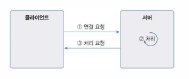
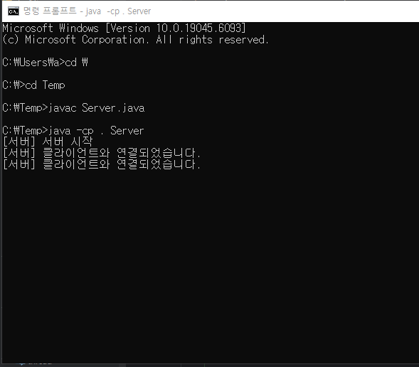
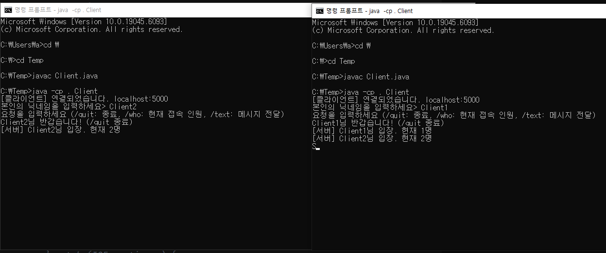

<!--more-->
### 네트워크 정리
네트워크 : 여러 컴퓨터들을 통신 회선으로 연결한 것
LAN : (지역적) 가정, 회사, 건물, 특정 영역에 존재하는 컴퓨터를 연결한 것
WAN : LAN을 연결한 것 (인터넷)
Port : OS가 관리하는 서버 프로그램의 연결 번호. 서버 시작 시 특정 Port 번호에 바인딩

### 서버와 클라이언트
서버: 서비스를 제공하는 프로그램 
클라이언트 : 서버에 서비스를 요청하는 프로그램 

클라이언트는 서버에게 서비스를 요청하고 서버는 클라이언트에게 서비스를 응답한다. 


## TCP란 무엇인가?
TCP는 **연결형 프로토콜**로, 상대방이 연결된 상태에서 데이터를 주고 받는 전송용 프로토콜이다. 
클라이언트가 연결 요청을 하고 서버가 연결을 수락하면 **회선이 고정**, 데이터는 고정 회선을 통해 전달 된다. 

#### 서버 부분
1. 서버 소켓이 존재해야한다. (ServerSocket 객체 생성)
2. ServerSocket의 포트를 지정해준다. 
```java
ServerSocket server = new ServerSocket;
sever.bind(new InetSocketAddress(50001)); // 특정 포트번호를 할당하고 싶을 경우 bind 메서드 사용 
```
3. 소켓이 생성 되었다면 클라이언트 연결 요청의 수락을 위해서 accpet()를 실행한다.
```java
Socket socket = server.accept();
```
accpet()를 사용하게 되면 소켓은 클라이언트의 연결 요청 이전까지 블로킹 상태가 된다.
그 후 클라이언트의 요청이 들어오면 블로킹이 해제 되고 통신용 Socket을 리턴하게 된다.

```java
public static void startServer() {
        // 스레드 Thread (실행단위)
        Thread thread = new Thread(){
            public void run() {

                try {
                    serverSocket = new ServerSocket(50001);
                    System.out.println("서버 시작");
                    while (true) {
                        System.out.println("\n 서버 연결 요청 기다림");
                        //연결 수락
                        Socket socket = serverSocket.accept();

                        // 연결된 클라이언트의 정보를 얻기
                        InetSocketAddress ia = (InetSocketAddress)socket.getRemoteSocketAddress();
                        System.out.println("서버 주소: " + ia.getAddress().getHostAddress() + ":" + ia.getPort());
                        
                        //연결 끊기
                        socket.close();
                        System.out.println("서버 종료");


                    }
                } catch (IOException e) {
                    throw new RuntimeException(e);
                }


            }
        };
        thread.start();
    }
```

#### 클라이언트 부분 
클라이언트가 서버에게 연결 요청을 하려면 Socket 객체를 생성하고 생성자 매개값에 IP, Port를 제공한다. 
```java
Socket socket = new Socket("IP",50001);
```
```
 public static void main(String[] args) {
        try{
            Socket socket = new Socket("localhost", 50001);
            System.out.println("클라이언트 서버 성공");
            
            socket.close();
            System.out.println("클라이언트 서버 종료");
        
        }catch (IOException e){
            System.out.println("연결 실패");
        }

    }
```
### 데이터 주고 받기 
클라이언트가 서버에 연결 요청(Connect())을 하고 서버가 연결 수락 (accept())를 했다면
양족의 socket 객체가 각각 입력 스트림과 출력 스트림을 얻을 수 있다.

#### 데이터 전송 방법 2가지 
```java
String data = "클라이언트가 서버로 보낼 데이터"
byte[] bytes = data.getBytes("UTF-8);
OutputStream os = socket.getOutputStream();
os.write(bytes);
os.flush();
```
```java
String data = "클라이언트가 서버로 보낼 데이터"
DataOutputStream dos = new DataOutputStream(socket.getOutputStream());
os.write(bytes);
os.flush();
```

#### 데이터 받아오기
받을 데이터를 저장할 byte[] 혻은 변수 생성 후 InputStream의 Read() 메소드를 이용하여 값을 받아옴
```java
byte[] bytes = new byte[1024];
InputStream is = socket.getInputStream();
int number = is.read(bytes);
String data = new String(bytes, 0, number, "UTF-8");
```
```java
//상대방이 DataOutputStream으로 문자열을 보낼 때만 DataInputStream으로 읽을 수 있다.
DataInputStream dis = new DataInputStream(socket.getInputStream());
String data = dis.readUTF();
```

### Thread
쓰레드는 프로세스 내부의 독립적인 실행 단위이다. (최소 실행 단위) 
운영체제는 프로세스를 관리하고 프로세스 안에서 스레드가 실행된다.

### Thread 상태 
*생성* : 스레드 객체 new 연산자를 이용하여 생성된 상태

*실행 대기* : 생성 상태에서 start()를 이용하여 실행 대기 상태로 돌입하고 실행을 기다리는 상태

*실행*: CPU 스케줄링에 따라 CPU를 점유하고 run() 메소드를 실행한다. 이때 스케줄링에 의해 다시 실행 대기 상태로 돌아갔올 수 있다. (이 과정이 반복)

*종료 상태* : 실행 상태에서 run() 메소드가 종료되어 실행할 코드 없이 스레드의 실행을 멈춘 상태 

*일시정지* ; 스레드가 실행할 수 없는 상태 다시 시작하려면 실행 대기로 갔다 실행. 

### Thread Pool
서버에게 동시에 여러사람이 접속 할 경우 스레드를 계속해서 생성을 하게 되는게 이는 메모리 과부화가 걸릴 수도 있다. 
따라서 스레드의 수를 좀 더 편하게 관리하기 위해 스레드 풀을 사용한다. 
Thread Pool은 일정 개수의 스레드를 미리 생성해 놓고 할당하여 관리한다. 

## 멀티 챗 프로그램 
간단한 통신 프로그램을 만들어보자

### Server 부분 
서버는 클라이언트의 접속여부를 판단하고, 클라이언트마다 독립적인 스레드를 할당해준다.
또한 할당한 스레드들을 스레드 풀에 넣어 관리한다.
```java
public class Server {

    static final private int PORT = 5000;  // 포트번호 설정 
    // 다중 접속을 TreadPool로 관리
    static final private ExecutorService POOL = Executors.newCachedThreadPool();  
    // 사용자 번호 자동 증가
    static final private AtomicInteger CLIENT_SEQ = new AtomicInteger(1);

    // 사용자 이름을 저장할 List
    private static final List<String> NAMES = new CopyOnWriteArrayList<>();
    // 클라이언트를 관리할 List
    private static final List<ClientHandler> CLIENTS = new CopyOnWriteArrayList<>();
    
    public static void main(String[] args) throws Exception {
        System.out.println("[서버] 서버 시작");
        //서버 소켓 생성
        ServerSocket serverSocket = new ServerSocket(PORT);

        // Ctrl + C 입력시 종료 
        Runtime.getRuntime().addShutdownHook(new Thread(() -> {
            System.out.println("\n[서버] 서버 종료...");
            POOL.shutdownNow();
        }));

        while (true) {
            // 클라이언트 연결 기다리기
            Socket clientSocket = serverSocket.accept();
            System.out.println("[서버] 클라이언트와 연결되었습니다.");
            int seq = CLIENT_SEQ.getAndIncrement();
            
            //스레드 풀에 클라이언트 정보 저장
            POOL.submit(new ClientHandler(clientSocket, seq));
        }
    }
```
그 클라이언트의 담당 Thread가 Pool에 저장이 되면 Client 측 요청을 InputStream으로 받고 서버측의 응답을 OutputStream으로 담아서 전송을 해주는 run()이 실행이 된다. 
```java
// 전체에게 전송
    static void broadcast(String message) {
        for (ClientHandler ch : CLIENTS) ch.send(message);
    }

    // 보낸 사람 제외 전송
    static void broadcastExcept(String message, ClientHandler except) {
        for (ClientHandler ch : CLIENTS) if (ch != except) ch.send(message);
    }


    public static class ClientHandler implements Runnable {
        private final Socket socket;
        private final int sequence;
        private BufferedReader in;
        private PrintWriter out;
        private String name;

        public ClientHandler(Socket socket, int sequence) {
            this.socket = socket;
            this.sequence = sequence;
        }

        @Override
        public void run() {
            try {
                // 클라이언트 Request 받는 InputStreamReader
                in = new BufferedReader(new InputStreamReader(socket.getInputStream(), StandardCharsets.UTF_8));

                // 클라이언트에게 Response 를 하기 위한 OutputStream
                out = new PrintWriter(new OutputStreamWriter(socket.getOutputStream(), StandardCharsets.UTF_8), true);

                // 닉네임 수신 및 등록
                String clientName = in.readLine();
                if (clientName == null || clientName.isBlank()) {
                    out.println("닉네임이 올바르지 않습니다. 연결을 종료합니다.");
                    return;
                }
                // 중복 체크(단순 거부)
                if (NAMES.contains(clientName)) {
                    out.println("이미 존재하는 닉네임입니다. 다른 이름으로 접속하세요.");
                    return;
                }
                this.name = clientName;

                NAMES.add(name);
                CLIENTS.add(this);

                out.println(name + "님 반갑습니다! (/quit 종료)");
                Server.broadcast("[서버] " + name + "님 입장. 현재 " + NAMES.size() + "명");

                // 명령 처리 루프
                String clientMessage;
                while ((clientMessage = in.readLine()) != null) {
                    System.out.println("[서버] 수신: " + clientMessage);

                    switch (clientMessage) {
                        case "/quit" -> {
                            out.println(name + "님 안녕히 가세요.");
                            return; // finally에서 정리
                        }
                        case "/who" -> {
                            out.println("현재 접속 인원: " + NAMES.size() + "명: " + String.join(", ", NAMES));
                        }
                        case "/text" -> {
                            out.println("메시지를 입력하세요:");
                            String msg = in.readLine();
                            if (msg != null && !msg.isBlank()) {
                                // 보낸 사람 제외 전체 방송
                                Server.broadcastExcept("[" + name + "] " + msg, this);
                                // 보낸 사람에게 확인
                                out.println("전송되었습니다.");
                            } else {
                                out.println("빈 메시지는 전송되지 않습니다.");
                            }
                        }
                        default -> out.println("알 수 없는 명령입니다.");
                    }
                }
            } catch (IOException ignored) {
            } finally {
                // 정리
                CLIENTS.remove(this); // 클라이언트 배열에서 삭제
                NAMES.remove(this.name); // 이름 배열에서 사용자 닉네임 삭제
                Server.broadcast("[서버] " + name + "님 퇴장. 현재 " + NAMES.size() + "명");
                try { socket.close(); } catch (IOException ignore) {}
            }
        }

        // 개별 전송(충돌 방지)
        void send(String message) {
            synchronized (out) {
                out.println(message);
                if (out.checkError()) {
                    CLIENTS.remove(this);
                    NAMES.remove(this.name);
                    try { socket.close(); } catch (IOException ignore) {}
                }
            }
        }
    }
}
```
### Client 부분 
클라이언트는 서버와 연결 여부를 확인하고 닉네임을 입력하여 OutputStream을 이용하여 서버에게 값을 전달해준다. 그 후 서버와 데이터를 주고받기를 한다. 
```java
public class Client {
    public static void main(String[] args) {
        String host = "localhost";
        int port = 5000;

        //서버에 연결
        try (Socket socket = new Socket(host, port);
             // 서버 응답 을 받는 BufferedReader
             BufferedReader in = new BufferedReader(new InputStreamReader(socket.getInputStream(), StandardCharsets.UTF_8));
             // 서버로 요청을 보내기 위한 PrintWriter
             PrintWriter out = new PrintWriter(new OutputStreamWriter(socket.getOutputStream(), StandardCharsets.UTF_8), true);
             // 사용자 입력을 받기 위한 BufferedReader
             BufferedReader keyboard = new BufferedReader(new InputStreamReader(System.in, StandardCharsets.UTF_8))
        ) {
            // 서버 연결 확인 
            System.out.println("[클라이언트] 연결되었습니다. " + host + ":" + port);

            // 닉네임 입력
            System.out.print("본인의 닉네임을 입력하세요> ");
            String name = keyboard.readLine();
            out.println(name);

            // ★ 수신 전용 스레드: 서버가 아무 때나 보내는 방송을 계속 출력
            Thread listener = new Thread(() -> {
                try {
                    String line;
                    while ((line = in.readLine()) != null) {
                        System.out.println(line);
                    }
                } catch (IOException ignored) {}
            }, "server-listener");
            listener.setDaemon(true); //데몬 스레드로 설정 다른 메인 스레드가 종료시 자동 종료
            listener.start();

            // 서버에게 송신
            while (true) {
                System.out.println("요청을 입력하세요 (/quit: 종료, /who: 현재 접속 인원, /text: 메시지 전달)");
                // 사용자 입력 받기
                String command = keyboard.readLine();
                if (command == null || command.isBlank()) {
                    System.out.println("공백은 입력하실 수 없습니다.");
                    continue;
                }

                //서버에게 전달
                out.println(command);

                // 사용자가 /text일 경우
                if ("/text".equals(command)) {
                    // 서버가 "메시지를 입력하세요:" 를 방송/응답으로 보냄 → listener가 화면에 출력함
                    String message = keyboard.readLine(); // 사용자가 실제 메시지 입력
                    if (message != null) out.println(message);
                    // 이후 "전송되었습니다."도 listener가 출력
                }

                if ("/quit".equals(command)) {
                    break; // 종료
                }
            }
        } catch (IOException e) {
            e.printStackTrace();
        }
    }
}
```
### 결과 
서버에서 두 개의 클라이언트와 연결


클라이언트는 접속 후 닉네임 입력
