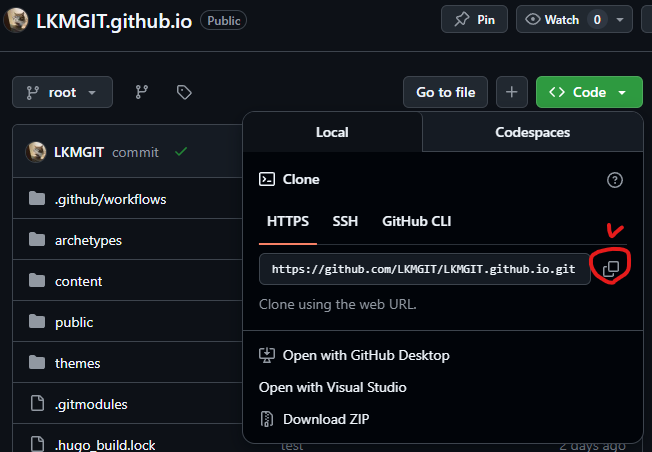
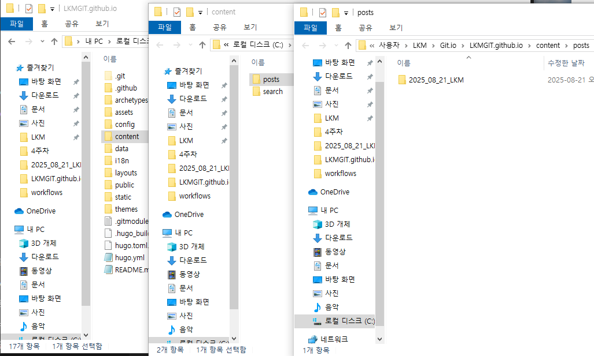
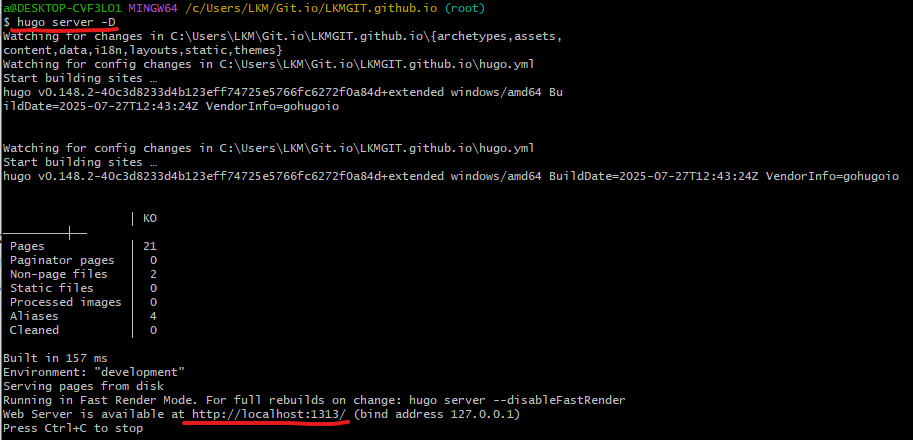

<!--more-->
## 글 작성 방법

### 로컬 환경에 hugo가 설치 되어 있지 않은 경우
1. winget이 있는지 확인 (없는 경우 Microsoft Store에서 "App Installer"설치 후 다시 실행)
- winget -v
2. Hugo Extended 설치
- winget install --id Hugo.Hugo.Extended -e
3. 설치 확인
- hugo version

### Git clone 후 최신화 및 Branch 생성
1. 원격 레포를 로컬 공간에 클론
- git clone https://github.com/LKMGIT/LKMGIT.github.io.git
  
2. 작업 공간 최신화 확인
- git fetch origin
- git rebase origin/root (fetch 했는데 로컬과 다른 파일이 있다면 진행)
- git pull -ff-only ( 위에 rebase 가 안되면 해보기)
3. 새 branch 생성
- git checkout -b post/파일명 

### 글 작성 하기 
1. index.md 파일 생성하기
- hugo new --kind post posts/파일명/index.md (폴더 위치는 C:\Users\LKM\Git.io\LKMGIT.github.io\content\posts 안에 있음)

2. 파일 형식 보면서 글 쓰기 (글 구성은 수정가능)

### 글 작성 후 PR
*** 반드시 PR을 하기 전 fetch를 진행 ***
1. 로컬에서 미리보기 
- hugo server -D (로컬에서 서버 열어서 자기가 쓴 글 확인하고 이상한 부분 있으면 수정 로컬 켜놓고 작업하면 바로바로 보기 좋습니다)

2. 로컬에서 확인이 끝나고 PR 하는 방법 
- git add .
- git commit -m "Post: 파일명 by <작성자 ID>"
- git push -u origin post/파일명
..